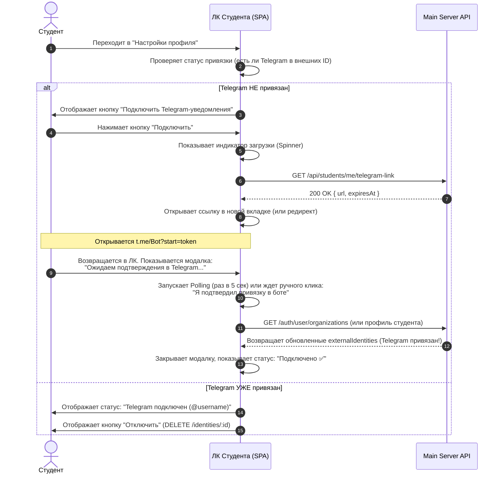

# 📱 ТЗ для ИИ-агента: Интеграция Telegram во Frontend (Client App)

Интеграция делится на два независимых клиентских интерфейса:
1.  **Личный кабинет студента (Student Portal)** — для привязки личного Telegram-аккаунта и получения уведомлений.
2.  **Панель управления администратора (Admin UI)** — для настройки бота школы, включения/выключения интеграции и тестирования рассылок.

---

## 1. Личный кабинет студента (Student Portal)

### 1.1 UI/UX Сценарий привязки аккаунта


### 1.2 Важные требования к UX Студента:
- **Обработка TTL токена**: Ссылка `expiresAt` валидна только **15 минут**. Если пользователь не перешел по ней вовремя, UI должен отобразить ошибку: *"Срок действия ссылки истек. Пожалуйста, сгенерируйте новую ссылку."* и предложить кнопку "Сгенерировать заново".
- **Интерактивные кнопки**: Рекомендуется открывать ссылку `t.me/{botUsername}?start={linkToken}` на десктопе во внешней вкладке, а на мобильных устройствах — напрямую запускать приложение Telegram.

---

## 2. Панель управления администратора (Admin UI)

Администратор настраивает уникального Telegram-бота для всей организации.

### 2.1 UI/UX Сценарий настройки интеграции
1.  **Каталог интеграций**: Администратор заходит в раздел "Интеграции", видит карточку **Telegram** со статусом (Не настроено / Активно / Отключено).
2.  **Форма настройки** (при клике на Telegram):
    *   **Bot Token** (Поле ввода пароля `type="password"`): токен, полученный от `@BotFather` (например, `123456789:ABCdef...`).
    *   **Bot Username** (Текстовое поле): имя пользователя бота без символа `@` (например, `MozartSchoolBot`).
    *   **Webhook Secret** (Текстовое поле, readonly, с кнопкой "Скопировать" и "Сгенерировать"): секретный ключ, используемый для верификации вебхуков. UI должен уметь генерировать случайную строку длиной 16-32 символа.
    *   **Group Chat ID** (Текстовое поле, опционально): ID группового чата для системных уведомлений школы (например, `-1001234567890`).
3.  **Сохранение**:
    *   При нажатии "Сохранить" UI отправляет `POST /organizations/:orgId/integrations`.
    *   В случае успеха Main Server триггерит перезапуск бота на внешнем сервере. UI показывает статус: *"Настройки сохранены. Бот успешно запущен!"*

---

## 3. TypeScript контракты и API

Агент, используй эти интерфейсы и эндпоинты при реализации API-клиента на фронтенде.

### 3.1 Модели данных (Types)

```typescript
// Конфигурация интеграции в БД
export interface OrgIntegrationConfigDto {
  id: string;
  organizationId: string;
  provider: 'TELEGRAM';
  isActive: boolean;
  // Поля, хранящиеся в JSON-поле config
  config: {
    botUsername: string;
    webhookSecret: string;
    groupChatId?: string;
  };
  // Секреты скрываются сервером при обычном GET (возвращается маскированная строка, например "********")
  secrets?: string; 
}

// Внешняя идентичность пользователя (Telegram ID)
export interface MemberExternalIdentityDto {
  id: string;
  userId: string;
  organizationId: string;
  provider: 'TELEGRAM';
  externalId: string; // Строковое представление Telegram User ID
  meta?: {
    username?: string;
    firstName?: string;
    lastName?: string;
  };
  createdAt: string;
}

// Ответ эндпоинта генерации ссылки
export interface TelegramLinkResponseDto {
  url: string;        // Ссылка вида t.me/Bot?start=UUID
  expiresAt: string;  // ISO дата истечения ссылки
}
```

### 3.2 Эндпоинты Main Server для Фронтенда

#### A. Студент: Получить ссылку на привязку
-   **Метод**: `GET`
-   **Путь**: `/api/students/me/telegram-link`
-   **Заголовки**: `Authorization: Bearer <Student_JWT>`
-   **Ответ (200 OK)**: `TelegramLinkResponseDto`
-   **Ошибки**:
    -   `400 Bad Request`: *"Интеграция с Telegram не настроена или не активна."* (Фронтенд должен заблокировать кнопку привязки и вывести предупреждение).

#### B. Админ: Сохранить настройки Telegram-бота
-   **Метод**: `POST`
-   **Путь**: `/organizations/:orgId/integrations`
-   **Заголовки**: `Authorization: Bearer <Admin_JWT>`
-   **Body**:
```json
{
  "provider": "TELEGRAM",
  "secrets": "123456789:AAF_Token_From_BotFather", // Пишется в plain text, сервер зашифрует его сам
  "config": {
    "botUsername": "MySchoolBot",
    "webhookSecret": "random-secure-string-123",
    "groupChatId": "-100123456789" // Опционально
  },
  "isActive": true
}
```
-   **Ответ (200 OK / 201 Created)**: `OrgIntegrationConfigDto`

#### C. Админ: Получить текущие настройки интеграций
-   **Метод**: `GET`
-   **Путь**: `/organizations/:orgId/integrations`
-   **Заголовки**: `Authorization: Bearer <Admin_JWT>`
-   **Ответ (200 OK)**: `OrgIntegrationConfigDto[]`
-   *Примечание фронтенд-разработчику: сервер маскирует токен в `secrets`, возвращая `"********"`. При повторном сохранении, если админ не менял токен, отправляйте маскированное значение обратно или не включайте поле `secrets` в запрос, чтобы сервер его не перезаписал.*

#### D. Студент/Админ: Отвязать Telegram-аккаунт
-   **Метод**: `DELETE`
-   **Путь**: `/identities/:id` (где `:id` — ID записи `MemberExternalIdentity`)
-   **Заголовки**: `Authorization: Bearer <User_JWT>`
-   **Ответ**: `204 No Content`

---

## 4. Дополнительная важная информация (Кейсы сбоев)

1.  **Пользователь уже привязан к другой школе в боте:**
    *   Telegram Bot Server вернет ошибку `IDENTITY_CONFLICT` во время взаимодействия с ботом.
    *   Бот напишет пользователю в чате: *"Этот Telegram-аккаунт уже привязан к другому профилю."*
    *   Фронтенд на это никак не влияет напрямую, но должен позволять обновить статус по кнопке «Проверить подключение».
2.  **Потеря соединения (Offline во время привязки):**
    *   Если студент нажал кнопку привязки, ушел в Telegram, а ЛК закрыл — при следующем входе ЛК должен просто проверить статус привязки через стандартный запрос профиля. Если привязка в TG прошла успешно — кнопка автоматически изменится на "Подключено ✅".
3.  **Безопасность Webhook Secret:**
    *   Фронтенд должен генерировать `webhookSecret` автоматически (например, используя криптографически стойкий генератор псевдослучайных чисел на клиенте: `crypto.getRandomValues`) и подставлять его в форму, чтобы администратору не приходилось придумывать пароли вручную.
